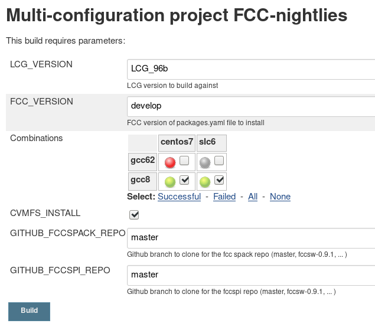

FCC Software Infrastructure
===========================

Table of Content:

- Main components
- Building the stack
- Nightlies
- Releases

## Main components

The FCC build infrastructure combines the following tools:

- [Github repositories](#github-repositories): Host the code to run the internal tasks
- [Jenkins](#jenkins): Server to automate tasks
- [CVMFS](#cvmfs): Network file system to deploy the experiment software
- [CDash](#cdash): Dashboard to visualize the result of the different builds
- [FCC Jira Issues](#jira): Track issues and tasks


### Github repositories

Most of the FCC Software code is hosted on the official Github project: [HEP-FCC](https://github.com/HEP-FCC/).
Repositories on this project can be classified on three main categories:

- [FCCSW](https://github.com/HEP-FCC/FCCSW): Common software package for all FCC experiments.
- FCC Externals: Specific software packages for the FCC experiment
    + [Heppy](https://github.com/HEP-FCC/heppy): Python framework for HEP Data Analysis
    + [FCC Analyses](https://github.com/HEP-FCC/FCCAnalyses): FCC Specific Analyses
    + [dag](https://github.com/HEP-FCC/dag): Library and examples for DirectedAcyclicGraphs
- Build system tools: Scripts for software deployment and continuous integration.
    + [fcc-spi](https://github.com/HEP-FCC/fcc-spi): Integration tools
    + [fcc-spack](https://github.com/HEP-FCC/fcc-spack): Spack recipes to build and install FCC packages

### Jenkins

FCC makes use of the Jenkins server hosted and maintained by the EP-SFT team: [https://epsft-jenkins.cern.ch](https://epsft-jenkins.cern.ch).
Inside this server, there is a dedicated view for the [FCC Projects](https://epsft-jenkins.cern.ch/view/FCC/).

Current operations run through Jenkins are:

**Continuous integration builds**

Some of the previous software packages listed [above](#github-repositories)
are configured to automatically run builds for every new Pull Request. These builds take the code with the changes
proposed in the Pull Request and build the package. If the build phase is successful, then all tests are run.
Once the compilation and tests have been passed without errors, the Pull Request in Github is marked as good to
be merged after the corresponding code reviews.

For each package configured with this continuous integration process we have three different jenkins job:

    + `<package_name>-pullrequest-trigger`: It is the connection between Github and Jenkins, it gets triggered every time there is a new Pull Request or an existing Pull Request is updated.
    + `<package_name>-pullrequest-handler`: Receives the configuration set of options to spawn one build per combination of platform and compiler, i.e.: `centos7/gcc8` and `slc6/gcc8`.
    + `<package_name>-pullrequest-build`: Runs the build for a given combination. Each package has a different [build script](https://github.com/HEP-FCC/fcc-spi/tree/master/builds) to get built and run the corresponding tests.

In the case of FCCSW the result of the last job (`<package_name>-pullrequest-build`) the result of the CMake build and tests is reported
to the CDash dashboard and grouped into a [slot dedicated to Pull Requests](https://cdash.cern.ch/index.php?project=FCC#PullRequests).

The connection between Jenkins and Github is done through [this code](https://github.com/HEP-FCC/jenkins-pipelines). To add new platforms to the default configuration where pull-requests run on, add them to
[this file](https://github.com/HEP-FCC/jenkins-pipelines/blob/master/src/cern/root/pipeline/BuildConfiguration.groovy#L28-L35).

**Nightlies**

These are jobs that run every night or on a daily basis, each with a different purpose:

- [FCCSW](https://epsft-jenkins.cern.ch/view/FCC/job/FCCSW/): Build the latest version of [FCCSW](https://github.com/HEP-FCC/FCCSW) and run the tests (master branch on Github). Uses the latest stable release of the externals specified in the [init.sh](https://github.com/HEP-FCC/FCCSW/blob/master/init.sh) script inside the repo.
- [FCCSW-exp](https://epsft-jenkins.cern.ch/view/FCC/job/FCCSW-exp): Same as *FCCSW*, but using the latest version of the nightlies for the external dependencies (the result of *FCC-nightlies*)
- [FCC-nightlies](https://epsft-jenkins.cern.ch/view/FCC/job/FCC-nightlies/): Build the FCC External packages (develop versions) against the latest [LCG Release](http://lcginfo.cern.ch/#releases) version picked up by the project.
- [FCC-nightlies-exp](https://epsft-jenkins.cern.ch/view/FCC/job/FCC-nightlies): Same as *FCC-nightlies* but using the [latest version of the LCG nightlies (dev4)](http://lcginfo.cern.ch/release/dev4/).
- [FCC-cvmfs-install-nightlies](https://epsft-jenkins.cern.ch/view/FCC/job/FCC-cvmfs-install-nightlies/): Deploy the result of *FCC-nightlies* to CVMFS.


**Releases**
- [FCC-release-spack](https://epsft-jenkins.cern.ch/view/FCC/job/FCC-release-spack/): Build a release of the the FCC Externals (a set of specific stable versions, i.e: `94.2.0`, `96.0.0`) against the latest [LCG Release](http://lcginfo.cern.ch/#releases) version picked up by the project.
- [FCC-cvmfs-install](https://epsft-jenkins.cern.ch/view/FCC/job/FCC-cvmfs-install/): Deploy the result of *FCC-release-spack* to CVMFS.


### CVMFS

**Todo**

 in a fast, scalable, and reliable way

### CDash

**Todo**

### FCC Jira Issues

**Todo**


## Building the stack

**Note**: The following steps only work for CentOS7 and SLC6.

All the required scripts are hosted in the [fcc-spi](https://github.com/HEP-FCC/fcc-spi) repo:

```
git clone https://github.com/hep-fcc/fcc-spi
```

### Prepare the environment

These script are prepared to be run inside jenkins and they rely on the following environment variables to be set:

- `LCG_VERSION`: LCG Version used to build against (`LCG_96b`, `LCG_95`, `dev4`, ...).
- `FCC_VERSION`: FCC Version of the externals to build on top of the previous LCG stack.
- `COMPILER`: defines the compiler version using the same format as for the LCG Release (`gcc8`, `gcc7`, `gcc62`, ...).
- `BUILDTYPE`: `Release` for an `opt` build or `Debug` for a `dbg` build. This will be reflected in the name of the platform (i.e: `x86_64-centos7-gcc8-opt` vs `x86_64-centos7-gcc8-dbg`).
- `WORKSPACE`: This variable is automatically set by Jenkins to the current workspace. In our case, this is equivalent to the directory where `fcc-spi` was cloned.
- `weekday`: This variable is used if the LCG version corresponds to a development LCG version (i.e: `dev4`) then it runs considering the last LCG stack built for the day specified by `weekday`.

These variables can be defined with their corresponding default values by running:

```
source fcc-spi/quick-setup.sh
```

### Check the environment

After preparing the environment, `spack` is ready to install new packages on top of the LCG Release selected. To check the selected configuration, the following commands may be interesting:

- List known compiler:

```
$ spack compilers
==> Available compilers
-- gcc centos7-x86_64 -------------------------------------------
gcc@8.3.0
```

- Show spack configuration:

```
$ spack config get config
config:
  debug: false
  checksum: true
  verify_ssl: true
  dirty: false
  build_jobs: 16
  install_tree: $spack/opt/spack
  template_dirs:
  - $spack/share/spack/templates
  install_path_scheme: ${ARCHITECTURE}/${COMPILERNAME}-${COMPILERVER}/${PACKAGE}-${VERSION}-${HASH}
  module_roots:
    tcl: $spack/share/spack/modules
    lmod: $spack/share/spack/lmod
    dotkit: $spack/share/spack/dotkit
  build_stage:
  - $tempdir
  - $spack/var/spack/stage
  source_cache: $spack/var/spack/cache
  misc_cache: ~/.spack/cache
  install_missing_compilers: false
  build_language: C
  locks: true
  ccache: false
  db_lock_timeout: 120
  package_lock_timeout: null
```

In order to avoid conflicts with other `spack` instances present in the system, we modify the $HOME directory to point to our current $WORKSPACE. As a consequence, the hidden spack configuration files are locate in `$WORKSPACE/.spack`

```
$ ls -R $WORKSPACE/.spack
.spack:
config.yaml  linux

.spack/linux:
compilers.yaml  packages.yaml  repos.yaml
```

- Show default configuration for packages taken from the LCG Release:

```
$ cat $WORKSPACE/.spack/linux/packages.yaml

packages:
  all:
    compiler: [gcc, intel, pgi, clang, xl, nag]
    providers:
      awk: [gawk]
      blas: [openblas]
      daal: [intel-daal]
      elf: [elfutils]
      golang: [gcc]
      ipp: [intel-ipp]
      java: [jdk]
      lapack: [openblas]
      mkl: [intel-mkl]
      mpe: [mpe2]
      mpi: [openmpi, mpich]
      opencl: [pocl]
      openfoam: [openfoam-com, openfoam-org, foam-extend]
      pil: [py-pillow]
      scalapack: [netlib-scalapack]
      szip: [libszip, libaec]
      tbb: [intel-tbb]
      jpeg: [libjpeg-turbo, libjpeg]
  4suite:
    buildable: false
    paths: {4suite@1.0.2p1%gcc@8.3.0  arch=x86_64-centos7: /cvmfs/sft.cern.ch/lcg/releases/LCG_96b/4suite/1.0.2p1/x86_64-centos7-gcc8-opt}
  absl_py:
    buildable: false
    paths: {absl_py@0.7.1%gcc@8.3.0  arch=x86_64-centos7: /cvmfs/sft.cern.ch/lcg/releases/LCG_96b/absl_py/0.7.1/x86_64-centos7-gcc8-opt}
  agile:
    buildable: false
    paths: {agile@1.5.0%gcc@8.3.0  arch=x86_64-centos7: /cvmfs/sft.cern.ch/lcg/releases/LCG_96b/MCGenerators/agile/1.5.0/x86_64-centos7-gcc8-opt}
  aida:
    buildable: false
    paths: {aida@3.2.1%gcc@8.3.0  arch=x86_64-centos7: /cvmfs/sft.cern.ch/lcg/releases/LCG_96b/AIDA/3.2.1/x86_64-centos7-gcc8-opt}
  alpgen:
    buildable: false
    paths: {alpgen@2.1.4%gcc@8.3.0  arch=x86_64-centos7: /cvmfs/sft.cern.ch/lcg/releases/LCG_96b/MCGenerators/alpgen/2.1.4/x86_64-centos7-gcc8-opt}
  arrow:
    buildable: false
    paths: {arrow@0.14.1%gcc@8.3.0  arch=x86_64-centos7: /cvmfs/sft.cern.ch/lcg/releases/LCG_96b/arrow/0.14.1/x86_64-centos7-gcc8-opt}
  asn1crypto:
    buildable: false
    paths: {asn1crypto@0.24.0%gcc@8.3.0  arch=x86_64-centos7: /cvmfs/sft.cern.ch/lcg/releases/LCG_96b/asn1crypto/0.24.0/x86_64-centos7-gcc8-opt}
  astor:
    buildable: false
    paths: {astor@0.8.0%gcc@8.3.0  arch=x86_64-centos7: /cvmfs/sft.cern.ch/lcg/releases/LCG_96b/astor/0.8.0/x86_64-centos7-gcc8-opt}

...
```

The previous `packages.yaml` file is filled with `fcc-spi/create_packages.sh` which is called inside `fcc-spi/jk-setup-spack.sh`

### Install a package

New packages can be built and installed using the following command:

```
spack install <package_name>
```

Notice that the package name might differ with respect to the names used by the `lcgcmake` system (package manager tool for the LCG Releases).

To install `acts-core`:

```
spack install acts-core
$ spack install acts-core
==> boost@1.70.0 : externally installed in /cvmfs/sft.cern.ch/lcg/releases/LCG_96b/Boost/1.70.0/x86_64-centos7-gcc8-opt
==> boost@1.70.0 : generating module file
==> boost@1.70.0 : registering into DB
==> cmake@3.14.3 : externally installed in /cvmfs/sft.cern.ch/lcg/releases/LCG_96b/CMake/3.14.3/x86_64-centos7-gcc8-opt
==> cmake@3.14.3 : generating module file
==> cmake@3.14.3 : registering into DB
==> dd4hep@01-10 : externally installed in /cvmfs/sft.cern.ch/lcg/releases/LCG_96b/DD4hep/01-10/x86_64-centos7-gcc8-opt
==> dd4hep@01-10 : generating module file
==> dd4hep@01-10 : registering into DB
==> doxygen@1.8.15 : externally installed in /cvmfs/sft.cern.ch/lcg/releases/LCG_96b/doxygen/1.8.15/x86_64-centos7-gcc8-opt
==> doxygen@1.8.15 : generating module file
==> doxygen@1.8.15 : registering into DB
==> eigen@3.3.7 : externally installed in /cvmfs/sft.cern.ch/lcg/releases/LCG_96b/eigen/3.3.7/x86_64-centos7-gcc8-opt
==> eigen@3.3.7 : generating module file
==> eigen@3.3.7 : registering into DB
==> graphviz@2.40.1 : externally installed in /cvmfs/sft.cern.ch/lcg/releases/LCG_96b/graphviz/2.40.1/x86_64-centos7-gcc8-opt
==> graphviz@2.40.1 : generating module file
==> graphviz@2.40.1 : registering into DB
==> root@6.18.04 : externally installed in /cvmfs/sft.cern.ch/lcg/releases/LCG_96b/ROOT/6.18.04/x86_64-centos7-gcc8-opt
==> root@6.18.04 : generating module file
==> root@6.18.04 : registering into DB
==> Installing acts-core
==> Searching for binary cache of acts-core
==> Warning: No Spack mirrors are currently configured
==> No binary for acts-core found: installing from source
==> Fetching https://gitlab.cern.ch/acts/acts-core/repository/v0.07.01/archive.tar.gz
######################################################################## 100.0%
==> Staging archive: /build/dir/spack/var/spack/stage/acts-core-0.07.01-jk6hz5q65rdsey2grjxmv6jfzvtgfyqq/archive.tar.gz
==> Created stage in /build/dir/spack/var/spack/stage/acts-core-0.07.01-jk6hz5q65rdsey2grjxmv6jfzvtgfyqq
==> Applied patch /build/dir/spack/var/spack/repos/fcc-spack/packages/acts-core/cmake-TGEO.patch
==> Building acts-core [CMakePackage]
==> Executing phase: 'cmake'
==> Executing phase: 'build'
==> Executing phase: 'install'
==> Successfully installed acts-core
  Fetch: 1.81s.  Build: 4m 0.01s.  Total: 4m 1.82s.
[+] /build/dir/spack/opt/spack/linux-centos7-x86_64/gcc-8.3.0/acts-core-0.07.01-jk6hz5q65rdsey2grjxmv6jfzvtgfyq
```

The previous output shows that `boost`, `cmake`, `dd4hep` and `root` packages, among others, are already provided by the LCG_96b release and therefore are picked from cvmfs instead of installing them.

New packages are by default installed inside `$WORKSPACE/spack/opt`.

Given the configuration options defined inside `packages.yaml`, if we try to build a package already provided by the LCG release, `spack` will automatically consider it as installed:

```
spack install root
$ spack install root
==> root@6.18.04 : externally installed in /cvmfs/sft.cern.ch/lcg/releases/LCG_96b/ROOT/6.18.04/x86_64-centos7-gcc8-opt
==> root@6.18.04 : already registered in DB
==> root@6.18.04 : marking the package explicit
```

With this configuration, package versions which are not provided by the choosen LCG Release will directly fail, since every package is mark with the flag `buildable: false` inside `packages.yaml` to avoid inconsistencies.

### Building all the fcc-externals

We call `fcc-externals` to the group of packages which are FCC-specific or not provided by the LCG Releases. These packages are listed as dependencies of a `dummy` package called `fccdevel`. Therefore, `spack install fccdevel` installs the group of packages known as `fcc-externals`.  

## Nightlies

FCC Nightlies are built using Spack as described before. Additionally, the corresponding Jenkins jobs are configured to generate binary files out of each installed package such that they can be installed and relocated into the CVMFS repository.

Nightlies are built using the Jenkins job [FCC-nightlies](https://epsft-jenkins.cern.ch/view/FCC/job/FCC-nightlies/), which runs everyday at 15:25. At this time, the LCG builds should be already present in CVMFS in case of building against one of the development version (`dev3`, `dev4`). Otherwise, the build gets aborted.

### Manual builds

Nightly builds can be [manually triggered](https://epsft-jenkins.cern.ch/view/FCC/job/FCC-nightlies/build):



- `LCG_VERSION`: LCG version to build against. It must be a valid release or nightly version and be already available in CVMFS.
- `FCC_VERSION`: Version of the FCC Externals to be installed. This is the equivalent to the `heptools-<VERSION>` files in LCGCMake. The specify `FCC_VERSION` will determine the `packages-<FCC_VERSION>.yaml` file picked from the `config` directory on the `fcc-spi` repository.
- `Combinations`: Each marked combination will spawn a different build for the compiler and operating system specified. By default, `gcc8` and `centos7`, `slc6` are marked.
- `CVMFS_INSTALL`: This flags determines whether the built packages should be install to CVMFS. If not marked, it will just build the required packages in a build node, without installing in CVMFS, which a good way to debug or to check that the build part is properly working for a given combination of options.
- `GITHUB_FCCSPACK_REPO`: Specify the Branch/Tag to be cloned from [https://github.com/HEP-FCC/fcc-spack](https://github.com/HEP-FCC/fcc-spack). This allows us to go back in time to previous releases of the different repositories required at build time.
- `GITHUB_FCCSPI_REPO`: Same as before, but for the `fcc-spi` repository.

### Build configuration

As for the internal configuration of the job itself, the shell script does the heavy lifting:

- Read the environment variables set by Jenkins and creates a `setup.sh` script with their values, so in case of debugging one can just source this script and get the same environment as for the build job.
- Run `fcc-spi/jk-setup-spack.sh` to download spack, clone some required spack `repos` (`hep-spack` and `fcc-spack`) with non-official spack recipes and place then at the correct location (`spack/var/spack/repos`).
- Setup the CDash options to send build results to server.
- Install the FCC software stack for the specified compiler. In particular it installs `fccdevel` which is a dummy package that contains all the fcc-externals declared as dependencies.
- Get hash of the installed package, this hash identifies our whole installation so we can reproduce the same build, ensuring the same combination of hashes for every installed package, i.e. our dummy package `fccdevel` and all its dependencies (`podio`, `fcc-edm`, ...).
- If the `CVMFS_INSTALL` flag was enabled:
  + Install patchelf, since this packages is needed to create the binary files.
  + Create a local build cache where all binaries will be generated (equivalent to tarfiles in LCGCMake).
  + Sends over all binary files to the cvmfs publisher node.
  + Dump all relevant environment variables to a file which is then use on [FCC-cvmfs-install-nightlies](https://epsft-jenkins.cern.ch/view/FCC/job/FCC-cvmfs-install-nightlies/) to reproduce the same environment.
- Finally prints a summary of the installed packages and its location, since they will be either taken from CVMFS or locally installed in the machine.

Note that if the build part did not success, then the installation to CVMFS will be aborted and hence the [FCC-cvmfs-install-nightlies](https://epsft-jenkins.cern.ch/view/FCC/job/FCC-cvmfs-install-nightlies/) will not be run.
